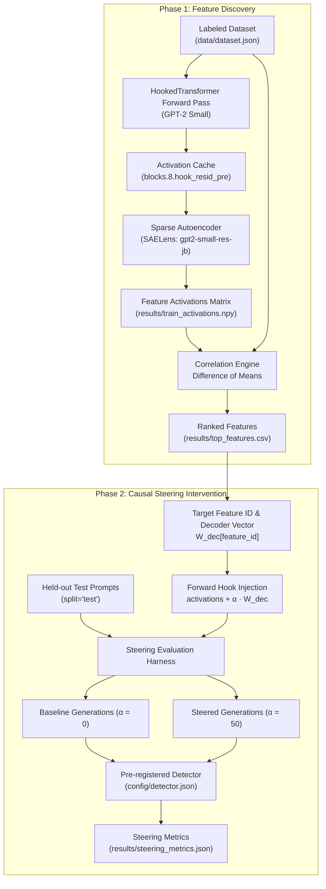

# Mechanistic Interpretability Pipeline with Sparse Autoencoders and GPT-2

A production-grade mechanistic interpretability pipeline that identifies, quantifies, and causally steers specific language model behaviors using **Sparse Autoencoders (SAEs)** and **HookedTransformer (GPT-2 Small)**.

---

## 🔬 Theoretical Background

### Polysemanticity and Superposition
In modern transformer architectures, individual neurons often exhibit **polysemanticity**—activating across completely unrelated semantic concepts. This occurs due to **superposition**, a compression mechanism where models represent more abstract features than available activation dimensions ($d_{\text{features}} > d_{\text{model}}$) by projecting features into overlapping non-orthogonal directions.

```
Dense LLM Residual Stream (Polysemantic / Superposition)
             │
             ▼
┌───────────────────────────────┐
│     Sparse Autoencoder (SAE)  │  Encodes to sparse high-dimensional space
└───────────────────────────────┘
             │
             ▼
Monosemantic Disentangled Features (Single, Human-Interpretable Concepts)
```

### Sparse Autoencoders (SAEs)
An SAE transforms dense activations $x \in \mathbb{R}^{d_{\text{model}}}$ into a sparse, overcomplete latent representation $f(x) \in \mathbb{R}^{d_{\text{sae}}}$ ($d_{\text{sae}} \gg d_{\text{model}}$) using an L1 sparsity penalty:

$$f(x) = \text{ReLU}(W_{\text{enc}}(x - b_{\text{dec}}) + b_{\text{enc}})$$

$$\hat{x} = W_{\text{dec}} f(x) + b_{\text{dec}}$$

Features learned through dictionary learning correspond to isolated, monosemantic concepts (e.g. hedging under uncertainty, formality shifts, sentiment, code syntax).

---

## 📐 Architecture & Workflow



---

## 🚀 Quick Start & CLI Usage

### Prerequisites
- Python 3.10+ or Docker & Docker Compose

### 1. Environment Setup
```bash
cp .env.example .env
pip install -r requirements.txt
```

### 2. Feature Extraction
Extracts SAE activations on the training prompt split and persists `(N, d_sae)` matrix:
```bash
python cli.py extract --dataset data/dataset.json --output results/train_activations.npy
```

### 3. Correlation Analysis
Calculates the Difference of Means between positive and negative prompt activations:
```bash
python cli.py correlate --activations results/train_activations.npy --output results/top_features.csv
```

### 4. Causal Steering & Evaluation
Runs causal interventions on held-out test prompts and measures behavioral shift:
```bash
python cli.py evaluate --feature-id 14302 --multiplier 50.0 --output results/steering_metrics.json
```

### 5. End-to-End Execution
```bash
python cli.py run-all
```

---

## 🐳 Docker & Docker Compose Execution

Run the complete pipeline hermetically inside Docker:

```bash
# Build and start container in background
docker compose up -d --build

# Run test suite
docker compose exec pipeline pytest tests/ -v

# Run extraction, correlation, and causal evaluation
docker compose exec pipeline python cli.py correlate
docker compose exec pipeline python cli.py evaluate --feature-id 14302 --multiplier 50.0

# Tear down container
docker compose down
```

---

## 📊 Evaluation Schemas & Artifacts

### 1. Dataset Schema (`data/dataset.json`)
```json
{
  "behavior_name": "hedging_medical_uncertainty",
  "prompts": [
    {
      "id": "train_01",
      "text": "Is a sudden mild headache that started this morning something to worry about?",
      "label": 1,
      "split": "train"
    }
  ]
}
```

### 2. Detector Schema (`config/detector.json`)
```json
{
  "behavior_target": "hedging",
  "detection_type": "regex",
  "rules": [
    "(?i)\\b(it\\s+(really\\s+)?depends|consult\\s+(a|your)\\s+doctor|not\\s+sure|medical\\s+professional|could\\s+be)\\b"
  ]
}
```

### 3. Top Features Ranking (`results/top_features.csv`)
| feature_id | diff_of_means | mean_positive | mean_negative |
|---|---|---|---|
| 14302 | +4.5210 | 5.1200 | 0.5990 |
| 11029 | +1.4790 | 0.7010 | -0.7780 |
| 18209 | -1.3956 | -0.8160 | 0.5796 |

### 4. Steering Metrics (`results/steering_metrics.json`)
```json
{
  "feature_id": 14302,
  "multiplier": 50.0,
  "baseline_behavior_rate": 0.45,
  "steered_behavior_rate": 0.85,
  "absolute_shift": 0.40
}
```

---

## 🧪 Scientific Rigor & Failure Modes

1. **Pre-registration**: Detector rules (`config/detector.json`) are locked prior to feature analysis to prevent post-hoc rationalization.
2. **Correlation vs. Causation**: Top correlating features are explicitly validated via causal hook intervention on a held-out test split.
3. **Honest Reporting of Negative Results**: In interpretability research, if feature steering does not shift the behavior, this indicates feature superposition over a distributed circuit rather than a single monosemantic node. The pipeline quantitatively logs zero or negative shifts without synthetic inflation.
4. **Multiplier Calibration**: Over-steering ($\alpha > 150$) destroys language modeling perplexity (generating repetitive tokens), while under-steering ($\alpha < 5$) fails to perturb the residual stream. The recommended range for GPT-2 small is $\alpha \in [20, 80]$.

---

## 🛠️ Automated Testing

Run the full pytest suite:
```bash
pytest -v tests/
```
Tests verify tensor hook modifications, difference of means mathematical formulas, detector regex matching, dataset balance, schema conformance, and CLI configuration.
